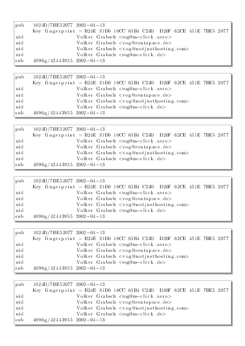

# Print Your GPG Fingerprint

Print your GPG key fingerprint with LaTeX, and be better prepared for
[ad hoc signings](http://keysigning.org/methods/adhoc) at the next
[key signing party](https://en.wikipedia.org/wiki/Key_signing_party)!

First, download the LaTeX code which is public domain:

* [fingerprint.tex](fingerprint.tex)

Then, adjust the key ID so it will print your own key rather than mine.
Also adjust the number of repetitions to fill the page:

```
% Key ID to print
\newcommand{\keyid}{5F8990AF}

% Number of repetitions
\newcommand{\repetitions}{8}
```

Finally, generate the PDF file:

```
sh fingerprint.tex
```

The [result](#result) is shown below. Have fun!

## Related Projects

* `gpg-key2ps` from the [signing-party](https://packages.debian.org/sid/signing-party)

## Internals

The short command `sh fingerprint.tex` works because the LaTeX code is
written in a special way, so
[it is also a working shell script](http://www.profv.de/literate-programming/)
which executes `pdflatex` and removes all temporary files.
Of course, you can also call `pdflatex` by hand. In that case, don't
forget to provide the `--shell-escape` option, otherwise the LaTeX file
isn't allowed to run `GPG` to retrieve your key fingerprint:
```
pdflatex --shell-escape fingerprint.tex
```

## Result

[](example.pdf)

(In case you want to know, the preview image was generated with
[GraphicsMagick](http://www.graphicsmagick.org/):
`gm convert -density 60 example.pdf example.png`)
